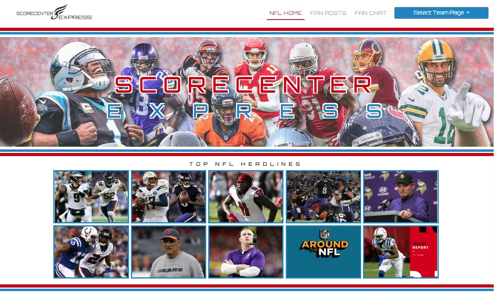
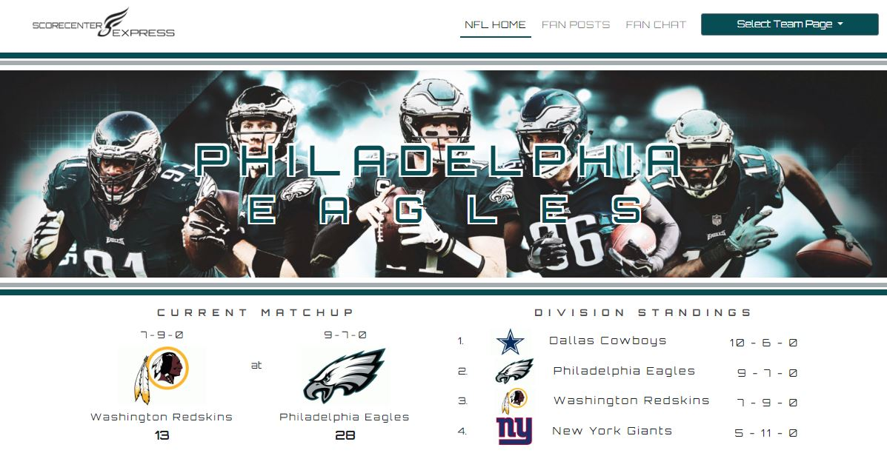
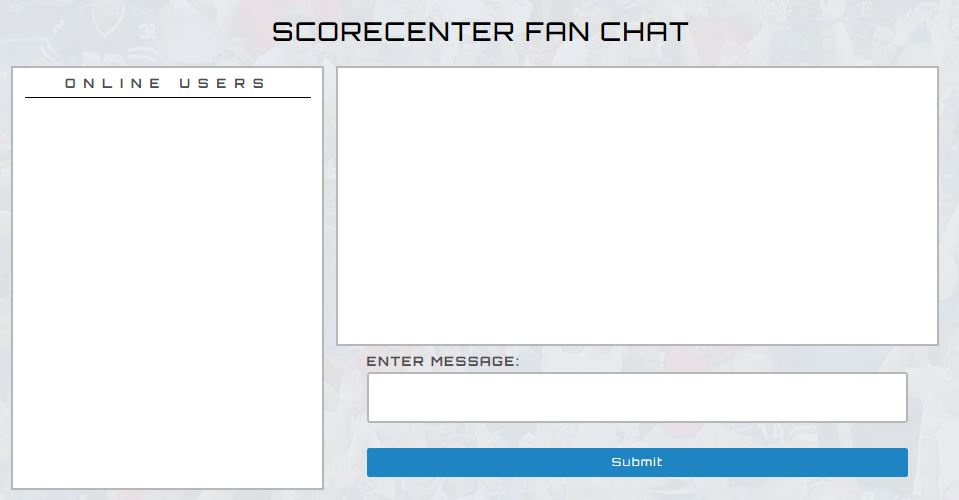
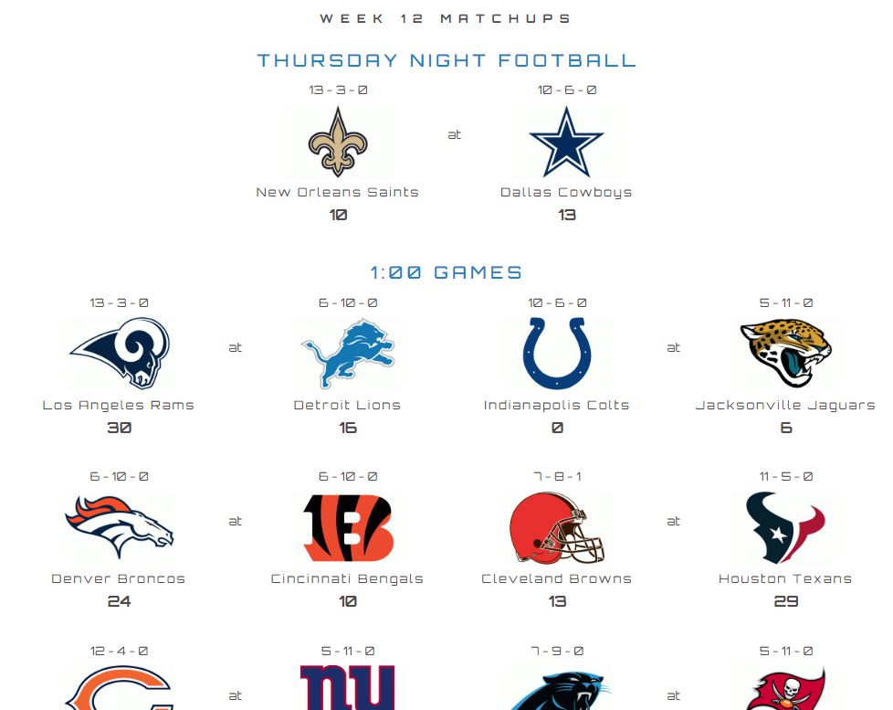

# ScoreCenter Express

[Link to the App](http://scorecenterexpress.herokuapp.com)

## Introduction

*ScoreCenter Express* brings you the ultimate fan experience, keeping you in the loop with league weekly matchups, scores, division standings and team rosters! In addition to the *NFL Home* landing page, *ScoreCenter Express* brings you team fanpages for each NFL team, custom designed to be sure to appeal. The app includes a *Fan Chat* section where fans can represent their teams through a built-in messenger and a *Fan Posts* section where fans can make posts and others can comment and/or "rec" others' comments.

The app uses 2 APIs, [MySportsFeeds](MySportsFeeds.com) and [NFL News API](Newsapi.org/s/nfl-news-api). From the former, I received updated team matchups, scores, team information, rosters and division standings and from the latter I received all news information.

## Proof of Concept

With this app I wanted to solidify basic server-side fundamentals and get a better understanding of back-end functions, while also having a polished and current front-end program. Using Node.js and Express I was able to build in databasing for the front-end with a library called Sequelize. I wanted to build upon my experience working with RESTful APIs as well. I learned with efficient routing, it makes it easier to remain organized with all of the information being used and keeping track of its many destinations throughout the app.

This app uses authentication through *Passport.js* with the help of *Brcypt* for password hashing. User cannot access any *ScoreCenter Express* functionality without a proper username and password.

For the *Fan Chat* section, we used *Socket.io*. Using RESTful methods, we were able to have the user ready to chat without providing additional login information upon arrival to the page. The same goes for the *Fan Posts* section where we used *Sequelize* to organize user information such as Username and Favorite team, information that is used throughout the app. We also used 8Sequelize* to organize fan post and reply data.

## Technologies Used

* HTML
* CSS
* JavaScript
* Node.js
* Express
* jQuery
* Bootstrap
* AJAX
* MySportsFeeds API
* NFL News API
* Sequelize
* Passport.js
* Bcrypt
* NPM
* Socket.io

## Screenshots

### Home Banner

### Team Banner

### Fan Posts

### Fan Chat

### Matchups

## Prospective Improvememts

* Using a back-end database such as mySQL or MongoDB to support review and restaurant data
* Authentication and login, to associate reviews with their author user
* Developing this to be a flagship app where partners are involved and it becomes a means for restaurant managers to better gauge customer feedback on their items and also patrons to better access the items they want on a more specific basis.
